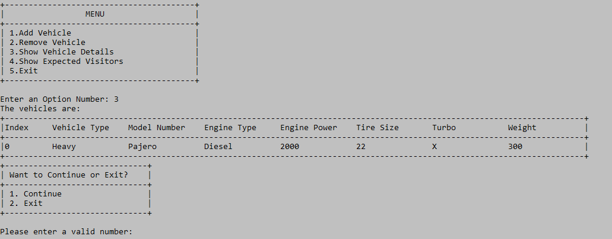

# SweetDisplay
An organized print in java

Dowanload the .jar file. Import it.
Create an Object like ( Display D = new Display())
Then pass a string.
D.showMenuBar(" ");
D.showInTable(" ");
D.endBar("");

Expected Output like:

